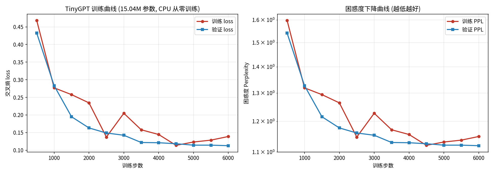

---
language:
  - zh
license: mit
library_name: pytorch
tags:
  - text-generation
  - conversational
  - chinese
  - gpt
  - from-scratch
  - tiny-llm
pipeline_tag: text-generation
model-index:
  - name: TinyGPT-zh-15M
    results:
      - task:
          type: text-generation
        dataset:
          name: self-built Chinese dialogue corpus
          type: custom
        metrics:
          - name: Validation Loss
            type: loss
            value: 0.1128
          - name: Validation Perplexity
            type: perplexity
            value: 1.12
---

# TinyGPT — 从零训练的中文对话模型

一个用 PyTorch 从零实现、从零训练的中文对话语言模型。没有使用任何预训练权重——所有参数都是在这台机器的 CPU 上，从随机初始化开始训练出来的。

## 成果

| 项目 | 数值 |
|---|---|
| 参数量 | **15.04M**（非嵌入 12.59M） |
| 架构 | Decoder-only Transformer |
| 词表 | 6374（自训练 BPE） |
| 训练数据 | 84.5 万 token / 1.97 万条对话 |
| 训练步数 | 6000 |
| 最终验证 loss | **0.1128**（perplexity 1.12） |
| 有效回答率 | **25 / 25** |
| 训练耗时 | 134 分钟（32 核 CPU，无 GPU） |

### 实际对话效果

```
你  > 为什么会下雨
AI  > 地面的水蒸发成水蒸气升到空中，遇冷凝结成小水滴形成云，
      小水滴不断聚集变大，空气托不住时就落下来，形成雨。

你  > 我心情不好
AI  > 难过是很自然的反应，说明这件事对你确实重要。慢慢来，不着急。

你  > 苹果比橘子贵，橘子比香蕉贵，哪个最便宜
AI  > 香蕉最便宜。价格排序是苹果最贵、橘子居中、香蕉最低。

你  > 如果加班我就不去，今天加班了，我去吗
AI  > 按你的规则，加班就不去，今天加班了，所以不去。

你  > 怎么才能睡得好
AI  > 可以这样一步步来：每天固定时间上床；睡前一小时别刷刺激内容；
      房间调暗调静；白天适当运动。
```

## 快速开始

```bash
# 看一批预设问题的回答
python3 demo.py

# 交互式对话
python3 chat.py

# 单次提问
python3 chat.py --prompt "为什么会下雨"

# 完整评测
python3 evaluate.py
```

只依赖 `torch` 和 `tokenizers`，环境已就绪。

## 目录结构

```
tiny-gpt/
├── model.py             GPT 架构实现（RoPE / GQA / SwiGLU / RMSNorm）
├── train.py             训练脚本（梯度累积 / 余弦退火 / 验证集）
├── chat.py              交互式对话
├── demo.py              批量演示
├── evaluate.py          评测脚本
├── plot.py              训练曲线绘制
├── gen_v4.py            语料生成 v4（知识库构建）
├── gen_v5.py            语料生成 v5（扩充成对话流）
├── gen_corpus.py        早期语料生成（保留作演进记录）
├── gen_extra.py         早期语料生成（保留作演进记录）
├── gen_v2.py            早期语料生成（保留作演进记录）
├── gen_v3.py            早期语料生成（保留作演进记录）
├── tokenizer_v5.json    训练好的 BPE 分词器
├── training_curve.png   训练曲线
├── ckpt/
│   ├── best.pt          最佳检查点（验证 loss 最低）
│   └── history.json     训练历史数据
├── data/
│   └── train_v5.jsonl   最终训练语料（1.97 万条对话）
└── logs/
    └── train_final.log  完整训练日志
```

## 模型架构

手写实现，不依赖 `transformers` 的模型代码：

- **RMSNorm** 前置归一化，比 LayerNorm 更省算力
- **RoPE** 旋转位置编码，让模型能处理训练长度内的任意位置
- **GQA**（分组查询注意力），8 个 query 头共享 2 组 KV，降低内存占用
- **SwiGLU** 前馈网络，比标准 ReLU MLP 表达力更强
- **权重共享**，输入 embedding 与输出投影共用参数，省下 400 万参数

配置：`d_model=384, n_layers=8, n_heads=6, n_kv_heads=2, seq_len=256`

## 训练曲线



验证 loss 从 0.43 平滑下降到 0.113，全程与训练 loss 贴合，没有过拟合。

## 数据是怎么来的

没有可用的开源中文对话小语料，所以**语料由教师模型（我）生成**，这是一次知识蒸馏实践。

构建过程分两步：

**第一步（gen_v4.py）—— 构建知识库**，按任务类型均衡组织：

| 任务类型 | 内容 |
|---|---|
| 常识问答 | 天气、天文、生物、生活等 41 个主题的多角度解释 |
| 概念定义 | 25 个技术/抽象概念 |
| 操作教程 | 16 个「怎么做」的分步骤说明 |
| 情绪陪伴 | 8 类情绪，每类多个恰当回应 |
| 逻辑推理 | 20 道推理题 |
| 闲聊对话 | 29 种日常问法与自我认知 |
| 算术换算 | 计算与单位换算 |

**第二步（gen_v5.py）—— 扩充成对话流**：把单轮问答包装进多轮对话（最多 8 轮），加入开场白、过渡句、结束语和延伸句，把语料从 27 万 token 扩到 **84.5 万 token**。

### 踩过的坑（值得记录）

调试过程中遇到一个**很隐蔽的 bug**，几乎让整个项目失败：

最初 `encode_conversation` 返回的 labels **没有做右移对齐**。模型因此在学习「复制当前输入 token」，而不是「预测下一个 token」。诡异之处在于 **loss 会降到 0.0000**，看起来训练完美成功——但生成时模型只会输出重复内容或无关句子。

诊断的关键线索是：模型在「你好」上的预测分布**熵高达 5.34**，top-1 概率只有 0.12，且预测的 token 是输入 token 的复制。

修复方式是让 `labels[i] = ids[i+1]`（在 mask 允许的位置），即真正实现标准的 next-token prediction。修好之后：

- loss 下降变慢但真实（不再 1 步掉到 0.3）
- 生成立刻正常

**教训**：loss 降得太快、太完美，往往说明任务被简化了。

另外还发现两个次要问题并一并解决：

1. **多轮语料中 85% 以「你好」开头**，导致模型学到「见到你好就回你好」的捷径 → 把开场白扩到 12 种（v5）
2. **模型规模与数据量不匹配**：37M 参数配 27 万 token 时 loss 震荡不收敛 → 降到 15M 参数配 84 万 token，训练立刻变平滑

### 推送模型到 HuggingFace 的镜像坑

模型文件（15M 权重、语料、训练脚本等 22 个文件）已通过 git LFS 成功推到 `hotsteel09/small_llm_O1`，但在更新 **README 模型卡元数据** 时踩到一个镜像站陷阱，记录如下：

`hf-mirror.com` 提供的 `/api/models/<repo>/commit/<branch>` 写入接口是**只读转发 + 伪造提交**：调用会返回

```json
{"success": true, "commitOid": "48a21bc...", "commitUrl": "https://huggingface.co/..."}
```

看起来完全正常，但**内容从未真正写入对象库**——生成的 commit 内容与父提交字节级相同（README 始终是 7116 字节的旧版本，`usedStorage` 也一直不变）。用 `cf-cache-status: MISS` 强制回源后，`etag` 与旧版本完全一致，可以确认不是缓存问题。

同时，git push 到 `refs/heads/main` 会被无条件拒绝（`incorrect old value provided` / `stale info`，`--force`、`--force-with-lease`、fast-forward 全部无效），但**推送到新分支完全正常**——已实测把带 YAML 的 README（7683 字节）推到 `test-branch` 并成功从远端读回。

**结论**：镜像站可以正常承载仓库内容的分发（clone/pull/文件下载），但**不能可靠地更新已存在的分支**。

**规避方式**：
- 内容分发走镜像，配置更新走官方域名或 [hf.co](https://huggingface.co) 网页端直接编辑模型卡
- 若只能走镜像，把自己需要的内容推到**新分支**，再在网页端调整默认分支
- 判断写入是否真的成功，不能只看 API 返回的 `success`，要回读比对 `raw/<revision>/README.md` 的**字节数与 etag**

## 能力边界

这是一个 15M 参数的小模型，请合理预期：

**擅长**：常见常识问题、情绪回应、分步骤说明、简单逻辑推理、日常闲聊

**不擅长**：
- 算术计算（会算错，如 `9×7` 答成 27）——小模型对数字缺乏抽象能力
- 训练语料之外的话题（会输出无关内容或串词）
- 长文本生成（超过两三句后容易跑题）
- 需要多步推理的复杂问题

**重要**：它只是在模仿训练语料的语言模式，回答不保证事实正确。

## 复现训练

```bash
python3 train.py \
  --tokenizer tokenizer_v5.json \
  --data train_v5.jsonl \
  --steps 6000 \
  --d-model 384 --layers 8 --heads 6 --kv-heads 2 \
  --seq 256 --batch 8 --accum 3 \
  --lr 2.5e-3 --eval-every 500
```

约 134 分钟（32 核 CPU，cgroup 内存上限 8G）。重新生成语料跑 `python3 gen_v4.py && python3 gen_v5.py`。

## 技术说明

**为什么要梯度累积**：运行环境的 cgroup 内存上限是 8GB。直接用 batch=24 会被 OOM 杀掉，所以改用 batch=8 + 累积 3 步，等效批大小 24，内存只用 3.1GB。

**为什么线程数是 8 而不是 32**：实测 32 线程时每步 22 秒，8 线程只要 1.7 秒——差异超过 10 倍。原因是模型较小，线程同步开销远超并行收益。
